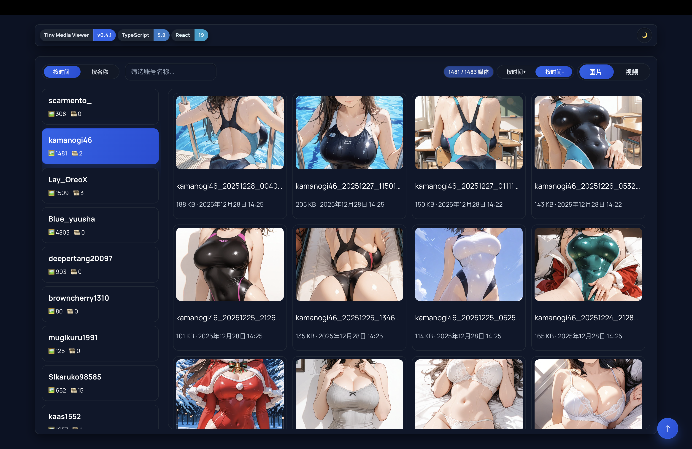

# TinyMediaViewer
<p align="center">
  
  
  
  
</p>

面向 `/Users/tiny/X` 媒体库的全栈预览工具。后端用 TypeScript + Fastify 快速扫描目录并输出带快照的结构化数据，前端用 Vite + React 提供“无需进入子目录就能看预览”的浏览体验。

## Demo
<video src="./demo.mp4" controls width="720" style="max-width: 100%; height: auto;" poster="./demo.png"></video>



## 架构与默认行为
- **后端（server）**：Fastify + TypeScript，按需扫描目录，提供 `/api/folder` 元数据接口，并通过 `/media/*` 直接回源真实文件。路径安全校验 + mtime 缓存，分类目录（images/gifs/videos 等）计数修正。
- **前端（web）**：Vite + React + TypeScript。账号列表与媒体网格；滑块式互斥切换：媒体类型（图片/视频）、排序（按时间/按名称）、时间方向（时间+/时间-，默认时间-）。预览弹窗支持左右按钮、键盘、滚轮、滑动，点击图片可关闭，浮动回顶按钮贴内容区。顶部悬浮信息条（产品名+版本、TS/React 胶囊）与主题切换（跟随系统，支持手动日/夜覆盖）。
- **运行配置**：默认媒体根目录为项目上级路径 `/Users/tiny/X`，可通过环境变量 `MEDIA_ROOT` 覆盖；预览数量与扫描上限可通过 `PREVIEW_LIMIT`、`MAX_ITEMS_PER_FOLDER` 调整。

## 目录结构
```
media-viewer/
├─ server/        # Fastify 后端
│  ├─ src/config.ts     # 配置与默认值
│  ├─ src/scanner.ts    # 目录扫描与缓存
│  ├─ src/routes.ts     # API 路由
│  └─ src/server.ts     # 入口 & 静态文件服务
└─ web/           # Vite 前端
   ├─ src/App.tsx       # 页面逻辑与布局
   ├─ src/components/   # FolderCard、Preview Modal 等
   ├─ src/api.ts        # API 封装
   └─ src/types.ts      # 类型定义
```

## 后端接口
- `GET /api/folder?path=<相对路径>`：返回当前目录元数据：
  - `subfolders[]`：每个子目录的预览（前 `PREVIEW_LIMIT` 个媒体缩略 + 图像/视频数量 + 最近修改时间）。
  - `media[]`：当前目录下可预览媒体（图片/GIF/视频），含大小、修改时间、直链 URL（`/media/<path>`）。
  - `breadcrumb`：面包屑路径；`folder.absolutePath` 便于确认物理位置。
- 静态文件：`/media/<path>` 直接读取 `MEDIA_ROOT` 下的真实文件，支持前端视频/图片展示与下载。

## 运行方式
1) **后端开发/运行**
```bash
cd media-viewer/server
npm install          # 已执行过，可跳过
MEDIA_ROOT=/Users/tiny/X npm run dev   # 默认端口 4000，需时可修改 PORT/SERVER_HOST
```
2) **前端开发**
```bash
cd media-viewer/web
npm install          # 已执行过，可跳过
npm run dev          # Vite 默认 5173，已配置代理到 4000
```
3) **前端打包 & 后端生产启动**
```bash
cd media-viewer/web && npm run build
cd ../server && npm run build && npm run start
```
4) **一键同时起后端+前端（开发）**
```bash
cd media-viewer
./run-dev.sh        # 默认 MEDIA_ROOT=/Users/tiny/X，可自行覆盖
```

## 关键实现细节
- **无需进入子目录的预览**：后端在列出父目录时同步扫描子目录，返回前 `PREVIEW_LIMIT` 个媒体快照，前端直接渲染。
- **性能与安全**：
  - 跳过隐藏文件，限制单目录处理条目数（`MAX_ITEMS_PER_FOLDER` 默认 20000）。
  - 路径规范化 + 根路径校验，避免越权访问。
  - 目录 mtime 缓存，需时可通过 `CACHE_VERSION` 提升强制刷新。
- **前端体验（Tiny Media Viewer）**：
  - 账号列表按当前类型数量 > 0 显示，支持搜索、排序切换。
  - 顶部悬浮信息条：GitHub 风格灰/蓝分割胶囊（产品名+版本、TS 5.9、React 19），滚动固定于顶端；日/月按钮可快速切换亮暗主题（默认跟随系统）。
  - 预览弹窗：左右按钮/键盘/滑动/滚轮切换，点击图片关闭，下载/关闭按钮并排。
  - 浮动回顶按钮随滚动、贴合内容右缘；列表高度自适应视口。

## 可选下一步
1. 增加缩略图/视频首帧生成与缓存，降低大文件首屏加载成本。
2. 支持递归统计、分页和受控并发扫描。
3. 增加全局搜索、标签/收藏、批量操作、快捷键提示。
4. 做成本地单体可执行（pkg/nexe 或 Rust 版），加鉴权/令牌。
